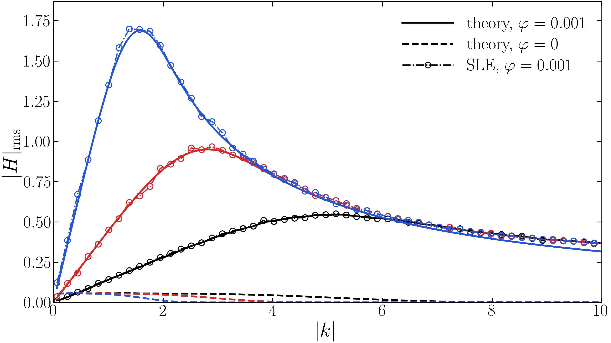
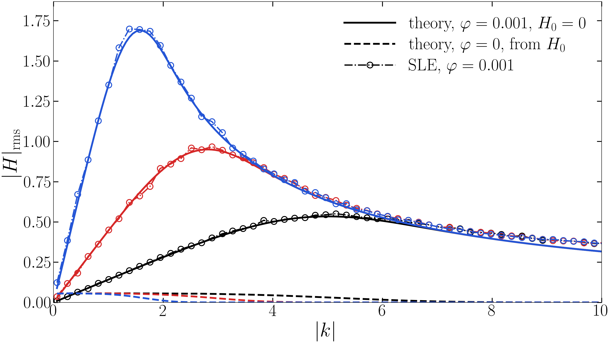
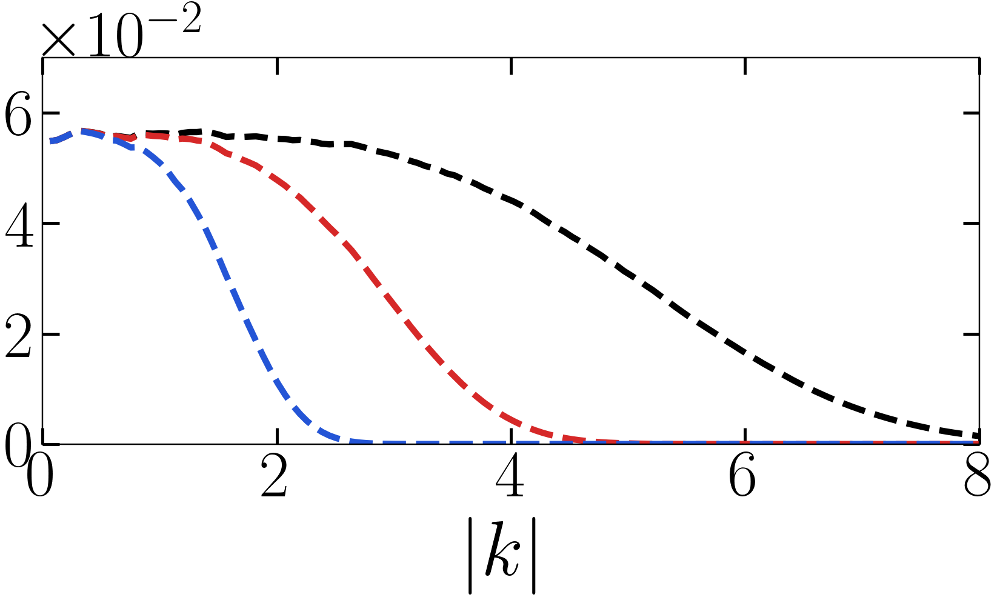

# SLE_TCW

随机润滑方程（SLE）热毛细波谱的作图脚本：读求解器输出的 `*.hfield`，做二维 FFT 与壳层旋转平均，再与线性解析解对照。

## 公式

以实测初谱 $H_0$（第一帧 $t=0.001$）为初值的解析演化：

$$|H(k,t)|^2 = |H_0(k)|^2 e^{-2k^4\tau} + \frac{\varphi L^2 k^2}{k^4}\left(1-e^{-2k^4\tau}\right),\qquad \tau = t-0.001$$

纯驱动解（$H_0=0$，噪声自 $t=0$ 起驱动，用绝对时刻 $t$）：

$$|H(k,t)| = \sqrt{\frac{\varphi L^2 k^2}{k^4}\left(1-e^{-2k^4 t}\right)}$$

噪声按面通量注入（$\partial_t h = \nabla\cdot\text{flux}$），傅里叶空间多一个 $ik$，故驱动功率 $\propto k^2$。

## 图

$H_0$ 锚定版（16:9）：



纯驱动版（16:9，三条实线在高 $k$ 重合）：



小图（5:3）：



## 代码

| 文件 | 作用 |
|---|---|
| `tcw_common.py` | 读 `hfield`、FFT 壳层平均、解析解函数 |
| `plot_tcw_H0_reference.py` | 主图：$H_0$ 锚定的解析演化 |
| `plot_tcw_H0_reference_pure_driven.py` | 纯驱动版（$H_0=0$） |
| `diagnose_highk_dt_residual.py` | 诊断：$k>8$ 数值高于理论的有限 $dt$ 效应 |

```
python plot_tcw_H0_reference.py
```

数据路径见脚本顶部的 `RESULTS` / `L10` 常量；文字用 LaTeX 渲染，需本机有 LaTeX。
